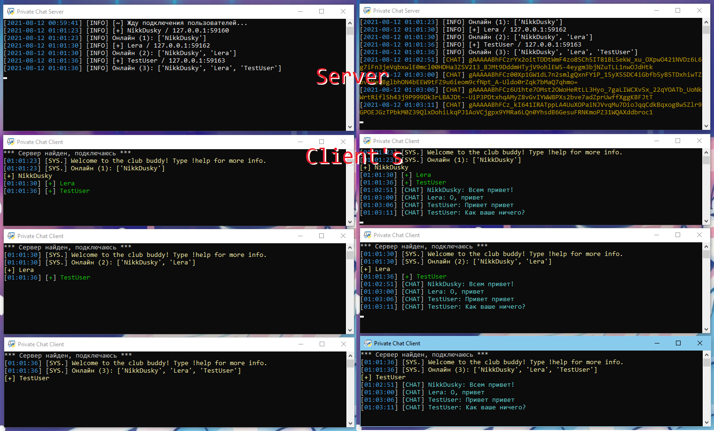
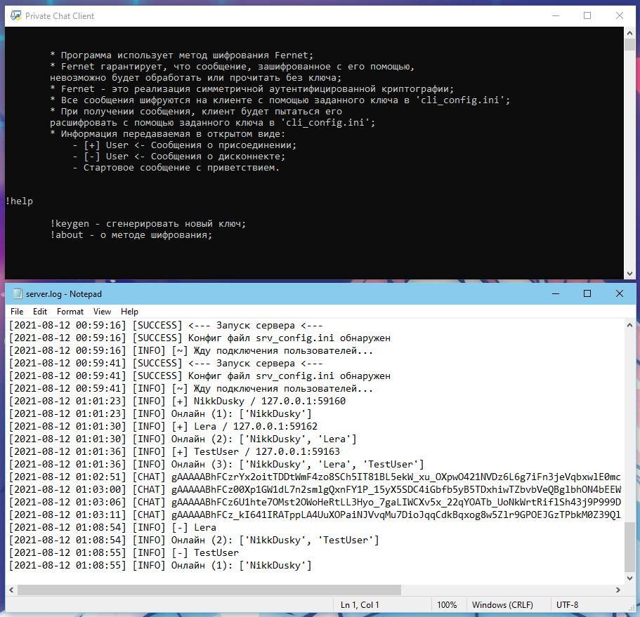

# Socket Private Chat

[](https://github.com/NikkDusky/Socket-Private-Chat/releases)
[](https://github.com/NikkDusky/Socket-Private-Chat/)

## Server Requirements

```
Python 3
pip install loguru
pip install configparser
```

## Client Requirements

```
Python 3
pip install loguru
pip install configparser
pip install cryptography
```

## About

Клиент-серверное приложение для создания приватного чата с шифрованием на клиентской стороне. Общение в данном чате передаётся в зашифрованном виде с помощью Fernet (AES-CBC). Для общения необходимо, указать в конфигах клиентов единый ключ, который можно сгенерировать посредством ввода команды !keygen. Если у участника чата ключ не совпадает с людьми ведущими беседу, данный участник не сможет расшифровать сообщения.

## Screenshots



